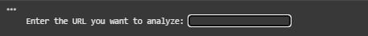
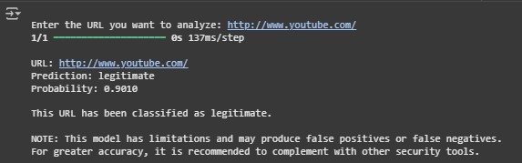
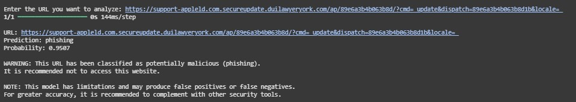
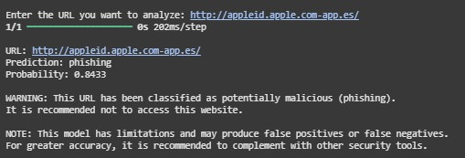

---

# Offline Phishing Detection Model for Websites Using Recurrent and Convolutional Neural Networks
[](https://colab.research.google.com/github/frangelbarrera/phishing-detection-rnn-cnn/blob/main/URL_Phishing_Detection.ipynb)


## 📌 Description  
This project implements an **offline** phishing website detection model, capable of operating without an internet connection by leveraging the knowledge acquired during its training phase.  
The architecture combines **Convolutional Neural Networks (CNN)** and **Recurrent Neural Networks (LSTM)** to capture both spatial and sequential patterns in URL features.  

The system analyzes multiple lexical, structural, and heuristic attributes of web addresses, classifying them as **legitimate** or **potentially malicious (phishing)** with high accuracy.

---

## 🚀 Key Features  
- **Hybrid CNN + LSTM architecture** for superior detection performance  
- **Offline execution**: no internet connection required for URL analysis  
- **Advanced feature extraction**: length, subdomains, special characters, suspicious patterns, and more  
- **Interactive analysis interface** for user-provided URLs  
- **Warning messages and recommendations** to enhance user security  
- **Modular, well-documented code** for easy adaptation and integration into other systems  

---

## 📊 Model Results  
- **Training accuracy**: ~97.7%  
- **Test accuracy**: ~88.9%  
- **AUC (Area Under ROC Curve)**: 0.89  

---

## 📂 Repository Structure  
```
/phishing-detection-rnn-cnn
│
├── dataset_phishing.csv         # Dataset used for training
├── URL_Phishing_Detection.ipynb # Main notebook with the complete workflow
├── my_model.keras                # Trained model ready for offline use
├── X_train.npy / X_test.npy      # Preprocessed datasets
├── Y_train.npy / Y_test.npy
├── history.npy                   # Training history
└── README.md
```

---

## ☁️ Running the Project with Google Drive and Colab  
To run this project seamlessly in **Google Colab** while keeping all files organized and persistent:  

1. In your Google Drive, **create a new folder** named:  
   ```
   phishing-detection-rnn-cnn
   ```
2. Upload **all project files** into this folder (`.ipynb`, `.npy`, `.csv`, `.keras`, etc.).  
3. In Colab, mount your Google Drive:  
   ```python
   from google.colab import drive
   drive.mount('/content/drive')
   ```
4. Navigate to the project folder in Drive:  
   ```python
   %cd /content/drive/MyDrive/phishing-detection-rnn-cnn
   ```
5. Run the notebook `URL_Phishing_Detection.ipynb` — it will directly access the files from your Drive folder, ensuring smooth execution without manual file uploads each time.

This setup keeps your workspace clean, ensures file persistence, and allows you to resume work instantly from any device.

---

## ⚙️ Requirements  
- Python 3.10+  
- TensorFlow  
- Pandas, NumPy, Matplotlib, Seaborn  
- scikit-learn  

Quick installation:  
```bash
pip install tensorflow pandas numpy matplotlib seaborn scikit-learn
```

---

## 📥 Usage  
1. Clone the repository:  
```bash
git clone https://github.com/frangelbarrera/phishing-detection-rnn-cnn.git
```
2. Load the trained model:  
```python
from tensorflow import keras
model = keras.models.load_model("my_model.keras")
```
3. Run the interactive analysis:  
```python
python URL_Phishing_Detection.ipynb
```

---

## ⚠️ Notes and Warnings  
- The model may **misclassify** some well-known legitimate sites due to limitations in the current implementation.  
- For greater accuracy, it is recommended to supplement its use with other security tools.  

---
## 🖼️ Screenshots

🔎 URL Analysis Input Interface


## ✅ Example of URL Classification Result


## ✅ Example of URL Classification Result


## ✅ Example of URL Classification Result

