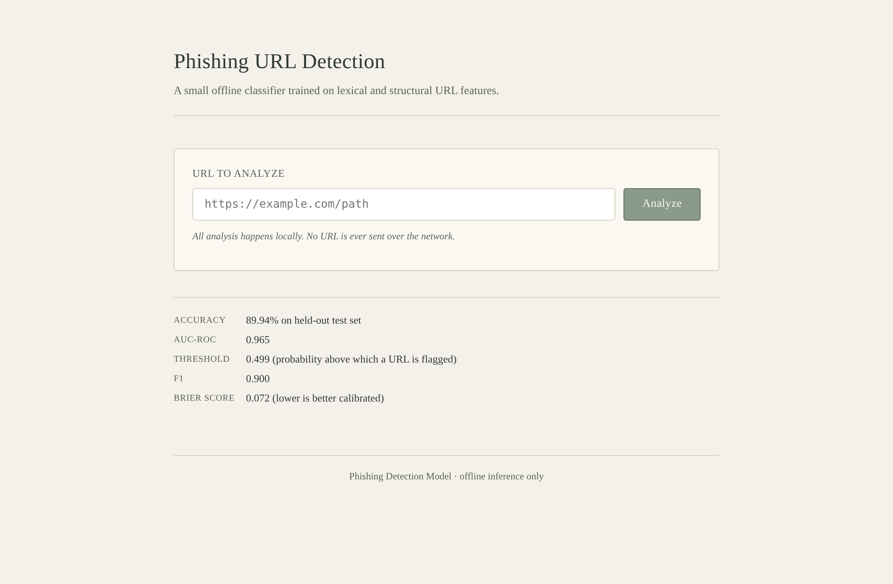
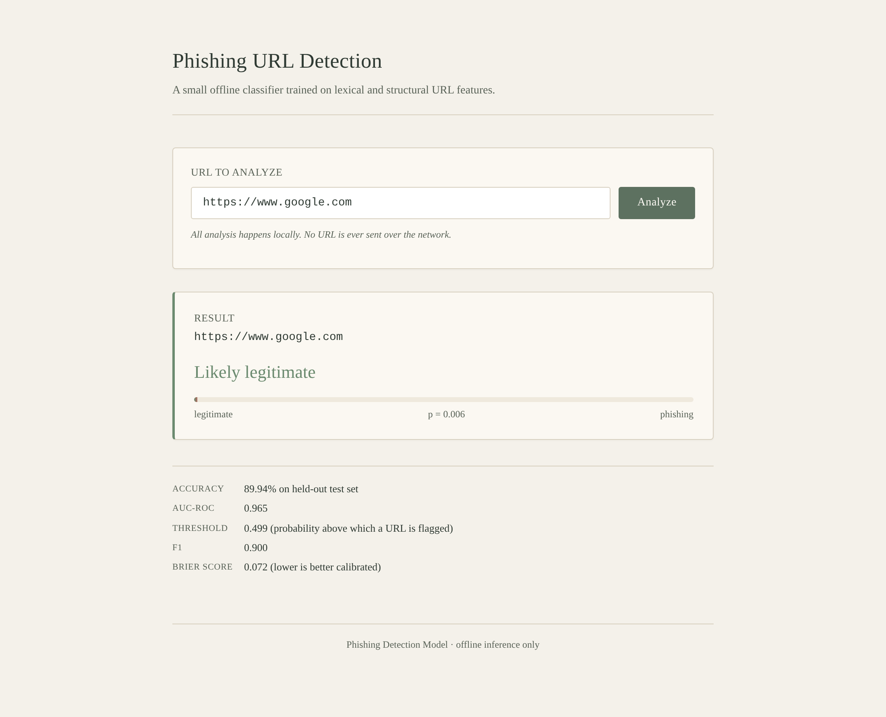
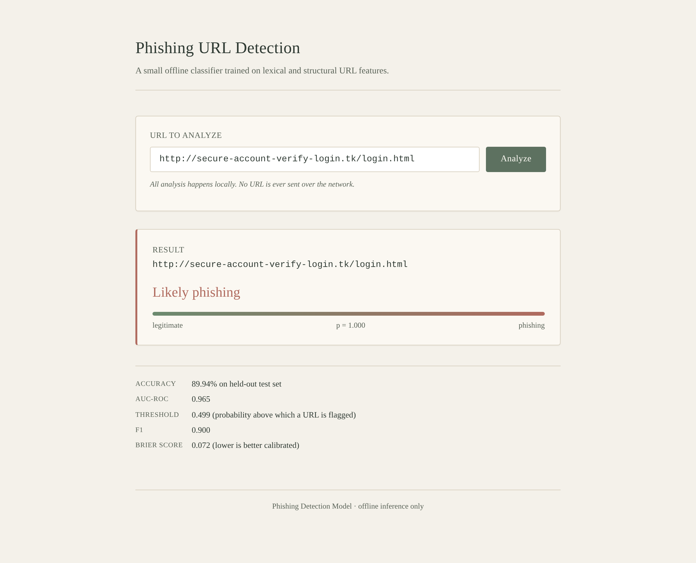

# Offline Phishing Detection Model for Websites

[](https://phishing-detection-rnn-cnn.onrender.com/)
[](https://colab.research.google.com/github/frangelbarrera/phishing-detection-rnn-cnn/blob/main/URL_Phishing_Detection.ipynb)
[](LICENSE)
[](https://github.com/frangelbarrera/phishing-detection-rnn-cnn/stargazers)
[](https://github.com/frangelbarrera/phishing-detection-rnn-cnn/commits)
[](https://github.com/frangelbarrera/phishing-detection-rnn-cnn/issues)
[](https://github.com/frangelbarrera/phishing-detection-rnn-cnn)
[](https://github.com/frangelbarrera/phishing-detection-rnn-cnn/graphs/contributors)
[](https://github.com/frangelbarrera/phishing-detection-rnn-cnn)

## Description

A lightweight **offline** phishing-URL detection model. All features are
extracted from the URL string itself — no network requests are made at
inference time, so the model can be used in air-gapped environments.

The classifier is a small two-hidden-layer MLP (≈ 5,300 parameters) trained
on 49 standardized lexical and structural URL features (lengths, special
character counts, digit ratios, TLD flags, word statistics, etc.) with
`binary_crossentropy` and `Adam`. A `StandardScaler` fit on the training
set is shipped alongside the model so inference reproduces the training
preprocessing exactly. Features are recomputed from the URL string at
both train and inference time, eliminating train/serve skew.

## Branches

This repository contains two branches:

- **`main`** (this branch) — A post-thesis engineering evolution that
  replaces the original CNN+LSTM architecture with a simpler two-hidden-layer
  MLP trained on the same URL features. Includes a Flask web UI, CLI,
  reproducible training script, and committed model artifacts. Test
  accuracy 89.94%, AUC-ROC 0.965.

- **`thesis-original`** — The defended academic thesis (July 2025) using
  the original CNN+LSTM hybrid architecture (Conv1D + LSTM, 138,898 params).
  Preserved exactly as defended, with reproducibility fixes applied
  post-hoc (corrected input shape, softmax output head, feature
  standardization, early stopping, AUC on probabilities). Test accuracy
  88.67%, AUC-ROC 0.946.

To switch between branches:
```bash
git checkout main              # post-thesis MLP evolution (this branch)
git checkout thesis-original   # defended CNN+LSTM thesis
```

## Model Results

| Metric | Value |
| --- | --- |
| Test accuracy | **89.94 %** |
| AUC-ROC | **0.965** |
| Average precision | 0.965 |
| F1 (at tuned threshold) | 0.900 |
| Brier score | 0.072 |
| Decision threshold | 0.499 |

Confusion matrix on the held-out 20 % test split (rows = true, cols = predicted):

```
              legit   phishing
legit          1024      119
phishing        111     1032
```

All metrics are computed on predicted probabilities (not argmax) and are
fully reproducible from `train.py` with seed `42`. See
`training_metadata.json` for the full training configuration and
`metrics.json` for the ROC / PR curves.

## Repository Structure

```
phishing-detection-rnn-cnn/
├── phishing_detector/        # Python package (feature extractor + detector)
│   ├── __init__.py
│   ├── features.py           # 49-feature offline URL featurizer
│   └── detector.py           # PhishingDetector: load model + predict
├── web/                      # Minimal Flask web UI for interactive testing
│   ├── app.py
│   └── templates/index.html
├── tests/
│   └── test_features.py      # Feature + detector unit tests
├── train.py                  # Reproducible training script
├── predict.py                # CLI for classifying URLs
├── URL_Phishing_Detection.ipynb  # Notebook wrapper around train.py
├── dataset_phishing.csv      # Source dataset (11,430 rows)
├── my_model.keras            # Trained model (97 KB)
├── scaler.pkl                # Fitted StandardScaler
├── feature_names.json        # Canonical feature order
├── metrics.json              # Full evaluation report (ROC, PR, etc.)
├── history.json              # Training history
├── training_metadata.json    # Versions, seed, architecture, metrics digest
├── SHA256SUMS                # Integrity checksums for all artifacts
├── requirements.txt
├── LICENSE
└── README.md
```

## Quick Start

```bash
git clone https://github.com/frangelbarrera/phishing-detection-rnn-cnn.git
cd phishing-detection-rnn-cnn
pip install -r requirements.txt

# Classify a URL from the command line
python predict.py "https://www.google.com"
python predict.py "http://secure-account-verify-login.tk/login.html"
```

For the interactive web UI, see the [Web UI](#web-ui) section below.

## Web UI

A minimal Flask app in `web/` lets you paste a URL and see the
model's verdict in a clean, pastel-themed page. Start it with:

```bash
python -m web.app --host 127.0.0.1 --port 5000
# Then open http://localhost:5000 in a browser
```

The form renders the model's headline metrics underneath the input,
and the result panel shows the predicted label, the phishing
probability, and a graduated meter from "legitimate" to "phishing".

**Empty state** — input form and model metrics:



**Legitimate URL** — `https://www.google.com` classified as legitimate
with probability 0.006:



**Phishing URL** — a suspicious URL classified as phishing with
probability 1.000:



## Retraining

To retrain from scratch (e.g. on a new dataset) on Google Colab:

1. Upload all repository files to a folder named
   `phishing-detection-rnn-cnn` in your Google Drive.
2. Open `URL_Phishing_Detection.ipynb` in Colab and run all cells.
   The notebook mounts Drive, installs dependencies, runs `train.py`,
   and overwrites the model artifacts in place.
3. After training, sync the new `my_model.keras`, `scaler.pkl`,
   `metrics.json`, `history.json`, and `training_metadata.json` back
   to the repository and commit.

Locally, simply run:

```bash
python train.py
```

The script writes all artifacts to the repository root and prints the
final test metrics.

## Requirements

- Python 3.10+
- TensorFlow ≥ 2.15
- scikit-learn ≥ 1.3
- pandas, numpy, matplotlib
- Flask ≥ 3.0 (only for the web UI)

Install with `pip install -r requirements.txt`.

## Notes and Limitations

- Features are purely lexical/structural. The model does **not** inspect
  SSL certificates, DNS records, or page content, so it cannot detect
  phishing pages hosted on otherwise-legitimate domains (e.g. compromised
  WordPress sites).
- Five features from the original dataset (`random_domain`,
  `domain_in_brand`, `brand_in_subdomain`, `brand_in_path`,
  `nb_external_redirection`) require curated brand lists or live network
  access and have been dropped from both training and inference for
  consistency.
- A few heuristic features (`https_token`, `prefix_suffix`,
  `abnormal_subdomain`) are noisy on the modern web — many legitimate
  sites use HTTPS, hyphens, or multiple subdomain levels. The model
  learns around this, but expect occasional false positives on
  multi-level legitimate domains.

## License

MIT — see [LICENSE](LICENSE).
